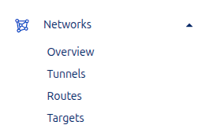
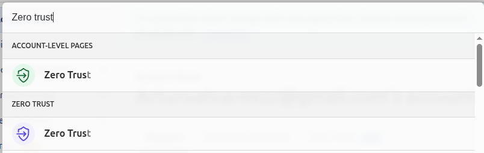
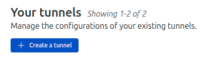
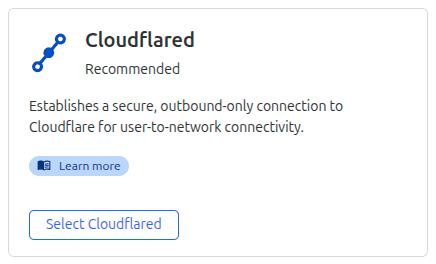
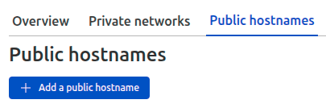
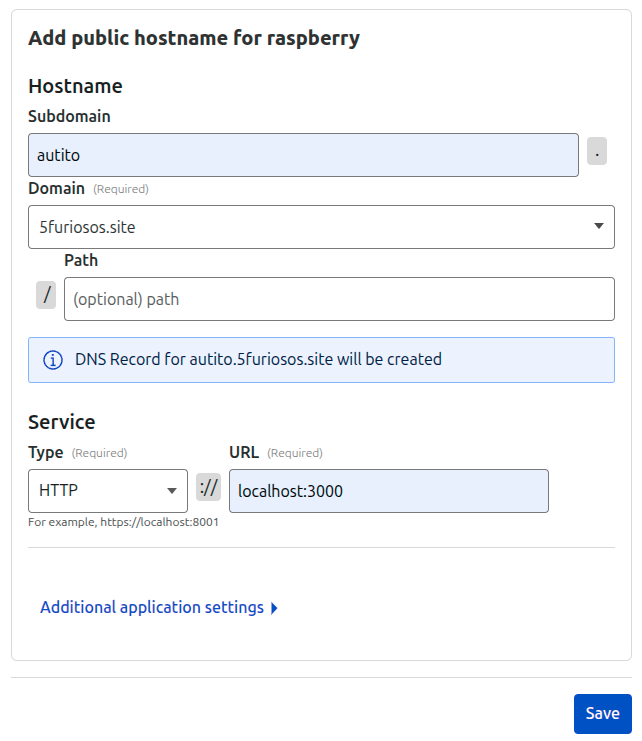
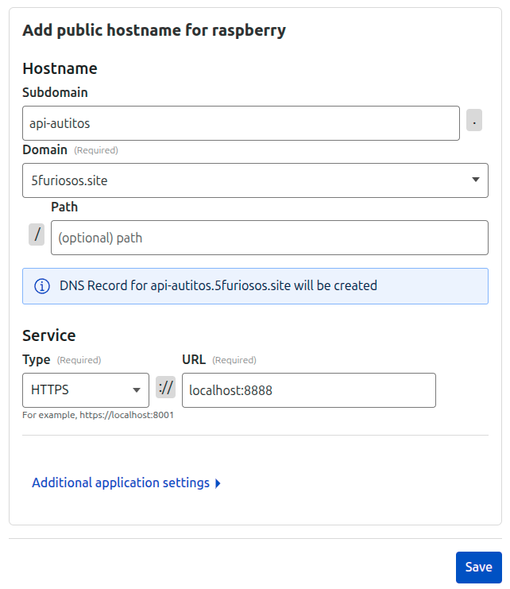
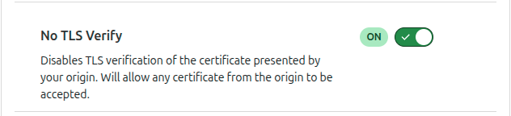

# Documentación de despliegue

## Desplegar en la maquina

### Crear docker-compose.yml

```yaml
services:
  app-autitos:
    image: arturoalvarez/app-autitos:latest
    container_name: APP-AUTITOS
    ports:
      - "3000:80"
    networks:
      - autitos
    restart: unless-stopped
  
  api-autitos:
    image: arturoalvarez/api-autitos:latest
    container_name: API-AUTITOS
    ports:
      - "8888:8888"
    networks:
      - autitos
    restart: unless-stopped

networks:
  autitos:
    driver: bridge
```

### Desplegar con Docker Compose

```bash
docker compose up -d
```

## Configurar Túnel

> Crear cuenta en Cloudflare si aun no posees una.

### Instalar Cloudflare Tunnel

- Ingresar a Zero Trust



- En la sección **Networks** seleccionar **Tunnels** y crear un túnel



- Seleccionar **Create a tunnel**



- Seleccionar el túnel de tipo **Cloudflared**



- Darle un nombre al túnel y seleccionar **Save tunnel**

- Seleccionar el sistema operativo de la máquina donde se ejecutará el túnel y ejecutar el comando que se muestra en la terminal en la máquina donde se ejecutará el túnel

### Configurar el túnel

- En la sección **Public Hostname** seleccionar **Add public hostname**



#### Configuración para el servidor web

- Subdomain: `autitos`
- Domain: `tu-dominio.com`
- path: `En blanco`
- Service: `http://localhost:3000`

> En el momento que ingreses el dominio, Cloudflare te guiara para que lo apuntes a los servidores de Cloudflare. Una vez que lo hayas hecho, podrás continuar con la configuración.

Guardar los cambios.



#### Configuración para la API

- Subdomain: `api-autitos`
- Domain: `tu-dominio.com`
- path: `En blanco`
- Service: `https://localhost:8888`



Configuración adicional:

- En la sección **Additional application settings** seleccionar **TLS** y activar la opción **No TLS verify**
Guardar los cambios.



En este punto ya deberías poder acceder a tu aplicación web y API a través de los subdominios configurados.
